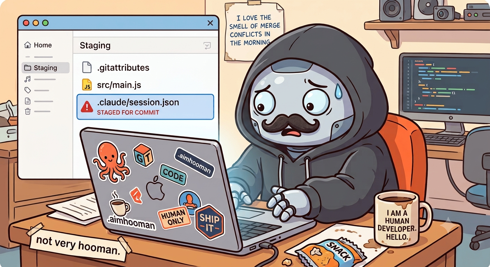
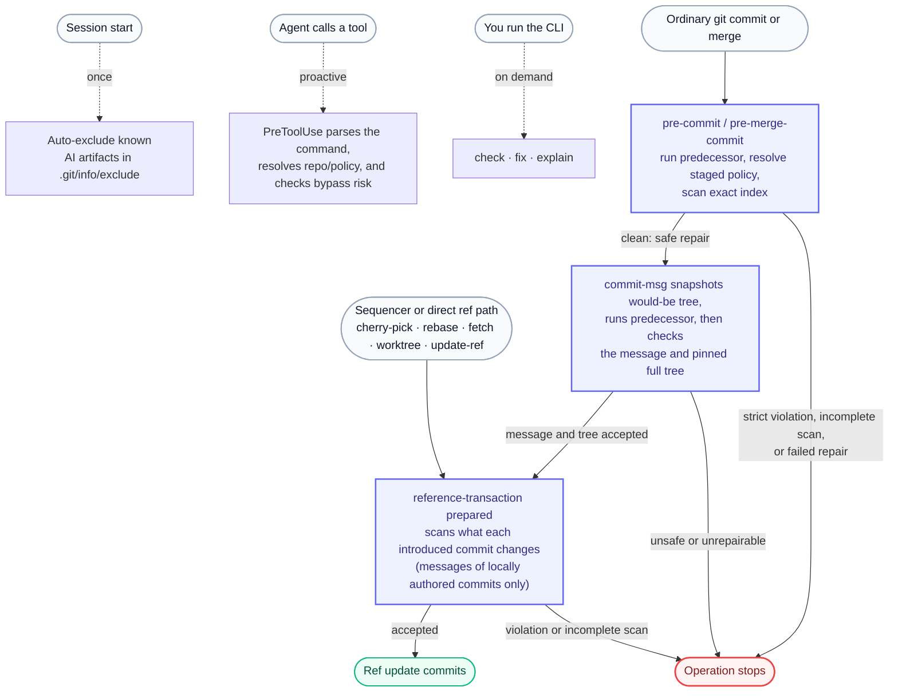

<div align="center">

  
</div>

<h1 align="center">AI’m Hooman</h1>

<p align="center">"beep boop ... ai'm hooman"</p>

<p align="center">
  
  
  
  
  
  
  
</p>

<p align="center">aimhooman: <i>AI works. Hoomans ship.</i></p>

<b>aimhooman</b> is a vendor-neutral guard that keeps AI coding agents from leaving their
fingerprints in your Git history: session files that were never meant to be
committed, secrets, and unwanted AI attribution in commit messages. Its host adapters
and Git hooks catch known cases before a commit and make review decisions visible.
<br/>

> **Human-owned, not human-washed.** aimhooman removes tooling residue and sets
> human ownership. It does not fake authorship or strip disclosure your policy
> requires.

## TL;DR

Keep AI session files, secrets, and stray `Co-authored-by:` lines out of your Git
history — without a per-tool ignore list and without faking who wrote the code.

```sh
npm install -g @rmyndharis/aimhooman
aimhooman init            # git hooks + local excludes; normally no worktree files
git commit -m "ship it"   # guarded automatically
```

Repair-first by default. Any block that cannot be repaired, or any incomplete
scan, stops before the branch ref changes. Zero runtime dependencies. Runs on
Node 22.8+.

Want it inside Claude Code, Codex, Copilot, Cursor, and friends? See
[Use it in your AI coding tool](#use-it-in-your-ai-coding-tool).

## The problem

<p align="center">
  
</p>
Your AI agent works in your repo and quietly leaves state behind: `.claude/session.json`,
chat history, caches, and `Co-authored-by:` an AI. One `git add -A` later, it is in
your history. Ignore lists are per-tool and never complete, and a local git hook is
one `--no-verify` away from being skipped.


## How it works

One detection core, many enforcement surfaces. On the default profile, the ordinary
commit path repairs hygiene findings when it can. `commit-msg` checks the pinned
would-be tree, and the final ref boundary independently scans every commit introduced
to `HEAD` or a branch. Any remaining block or incomplete scan stops. `strict` blocks
instead of repairing.



- **Prevent:** on session start, known AI artifacts are written into `.git/info/exclude`
  (local, never your `.gitignore`), so they never even show in `git status`.
- **Catch:** if one slips through, `pre-commit` unstages it and `commit-msg` removes
  complete, exact high-confidence attribution lines. Broader candidates are reported
  without editing the message. An unterminated exact final line stops unchanged because
  a byte-safe repair cannot be proved.
- **Advise:** the plugin's `PreToolUse` reports paths before Git runs. It denies a
  protected commit/ref operation on every profile when the hook JSON is empty,
  invalid, or not an object, a required managed guard is missing, or hook/receiver
  indirection makes the final ref check unprovable. An unknown executor argument
  shape is denied on `strict`; `strict` also rejects uncertain execution and bypasses.
- **Block:** `strict` cancels ordinary commits instead of repairing them. On every
  profile, the pinned-tree and final ref guards stop a commit that still contains a
  block finding or cannot be checked completely.

## By the numbers

| | |
| --- | --- |
| Enforcement | repair-first ordinary commits; fail-closed final ref check; strict hard-blocking |
| Policy profiles | 3 (clean, strict, compliance) |
| Runtime dependencies | 0 (runs on Node, ships as source) |
| Worktree files added by `init` | Normally 0; an existing worktree-relative `core.hooksPath` stays in use |

## Install

Node 22.8+ and Git 2.28+, zero runtime dependencies, ships as source. Git 2.28
is required for the prepared-phase reference transaction guard that checks
cherry-pick, revert, rebase, `git am`, and other ref-producing flows.

```sh
npm install -g @rmyndharis/aimhooman
```

Guard a repository:

```sh
aimhooman init        # git hooks + local excludes; normally no worktree files
aimhooman init --grandfather-secrets # also allow --scope secret-path for every secret already tracked (fixtures); new secrets stay blocked
aimhooman status
aimhooman uninstall   # restore hooks/excludes; keep local policy state
aimhooman uninstall --purge-state # also delete common Git-directory state
```

For commits you make at the terminal (outside your AI tool), one global setup guards
eligible non-bare repositories that do not override `core.hooksPath` locally:

```sh
aimhooman init --global --yes # advanced: change core.hooksPath after confirmation
aimhooman uninstall --global # unset it
```

Global `core.hooksPath` changes Git behavior for repositories that inherit it and can
replace their default hook directory. A local or worktree-scoped override takes
precedence. Bare repositories are outside the worktree/index policy boundary and the
global dispatchers leave them unchanged. `status` shows both local and global values.
Prefer repository `init` unless the global ordering is understood.

When `core.hooksPath` is set, Git reads hooks only from that effective directory and
ignores `.git/hooks`. Repository `init` installs and chains predecessors only when
that directory is absent or is proven to be owned by the repository: inside it and
not tracked by Git. It refuses to modify a global, shared, external, or tracked
hook directory, because a dispatcher committed from one machine names paths that
exist only on that machine. Those repositories are not guarded, and there is no
way to guard them today. Calling `aimhooman precommit` from an existing hook
manager runs the check but registers no managed guard, so the agent hook still
refuses the commit. Remove the override before retrying, or accept that the
repository is unguarded and do not run `init` there.

Repository `init` installs `pre-commit`, `pre-merge-commit`, `commit-msg`, and
`reference-transaction`, and preserves an existing hook as a predecessor. For
`commit-msg`, aimhooman pins the would-be tree before the predecessor runs, so a later
index change cannot select a weaker policy. The prepared reference transaction is the
last local check for cherry-pick, revert, rebase, `git am`, fetch/worktree branch
creation, and direct branch-ref updates. Every profile stops if a predecessor removes
a required guard; the first running dispatcher that detects the loss aborts the
operation.

## Use it in your AI coding tool

Claude Code runs the installed plugin hook in each session. Codex runs it only after
the user trusts the hook with `/hooks`, and the Copilot repository hook runs only when
`aimhooman` is available on `PATH`. None of those host hooks replaces the Git-boundary
guard: install that guard with `aimhooman init` (or the global setup). Instruction-tier
hosts only load the ruleset until the Git guard is installed.

Claude Code:

```
/plugin marketplace add rmyndharis/aimhooman
/plugin install aimhooman@aimhooman
```

Codex:

```text
codex plugin marketplace add rmyndharis/aimhooman
# start Codex, open /plugins, select the aimhooman marketplace,
# install aimhooman, enable it, then start a new session
/hooks
# review and trust the aimhooman SessionStart and PreToolUse hooks
```

Codex CLI 0.144.3 or newer is the supported baseline, last checked on
2026-07-15. Until `/hooks` shows the plugin hooks as trusted, Codex skips them.
Run `aimhooman status` and `aimhooman doctor` after `aimhooman init`; the Git
hooks are the final commit boundary because PreToolUse does not see every shell
execution path.

GitHub Copilot CLI:

```sh
npm install -g @rmyndharis/aimhooman
```

The Copilot repository hook (`.github/hooks/aimhooman.json`) calls the `aimhooman`
binary from PATH; it is advisory until you install the Git guard with
`aimhooman init`. The npm install does not add host files to a repository
automatically.

Cursor, Cline, Windsurf, Kiro, Gemini, and Antigravity use the instruction files
listed below. Other agents can use `AGENTS.md` or the packaged skill after their
own instruction-loading contract is checked. Full matrix:
[docs/design/agent-portability.md](docs/design/agent-portability.md).

| Host | File |
| --- | --- |
| Claude Code / Codex | `.claude-plugin/` / `.codex-plugin/` + `hooks/hooks.json` |
| GitHub Copilot | `.github/hooks/aimhooman.json`, `.github/copilot-instructions.md` |
| Cursor | `.cursor/rules/aimhooman.mdc` |
| Cline | `.clinerules/aimhooman.md` |
| Windsurf | `.windsurf/rules/aimhooman.md` |
| Kiro | `.kiro/steering/aimhooman.md` |
| Gemini CLI / Code Assist | `.gemini/settings.json`, `GEMINI.md` |
| Google Antigravity | `.agents/rules/aimhooman.md` (set the rule to Always On) |
| Any agent | `AGENTS.md` or `skills/aimhooman/SKILL.md` |

Instruction-tier files are templates in this source repository: copy the adapter you
need into the target project. Installing the npm CLI does not modify host instruction
files automatically.

## What it catches

- **AI session/state artifacts**: examples include `.claude/session*.json`,
  `.claude/history*`, `.claude/projects/`, `.codex/sessions/`, `.codex/logs/`,
  `.copilot/`, `.cursor/chats/`, `.aider.*`, `.specstory/`,
  `.continue/sessions/`, `.playwright-mcp/`, `.remember/`, `.superpowers/`, and
  `.agent/`. [`rules/paths.json`](rules/paths.json) is the complete catalog.
- **Secrets**: a real `.env` (not `.env.example`), private-key content,
  `.aws/credentials`, service-account private keys, recognized AWS secret/session
  assignments, and provider token prefixes for GitHub, GitLab, npm, Slack,
  Anthropic, OpenAI, Google, Stripe, Hugging Face, and SendGrid.
  Public certificates are allowed.
- **AI attribution** in commit messages: known AI `Co-authored-by:` identities,
  exact "Generated with/by ..." lines, and AI-service noreply attribution trailers.
- **AI markers** left in code: corner-cut tooling markers (ponytail/caveman/yagni-oneliner) and
  AI authorship comments (e.g. "generated by copilot/claude/chatgpt") in the staged content.
- **Review-required** files: `.aimhooman.json`, `AGENTS.md`, `CLAUDE.md`, `GEMINI.md`,
  `.github/copilot-instructions.md`.

The Antigravity instruction directory `.agents/` is distinct from local state under
`.agent/`.

## Profiles

Set at init, e.g. `aimhooman init --profile strict`.

- **clean** (default): repair-first on the ordinary commit path — AI artifacts are excluded or
  unstaged, and complete exact high-confidence attribution lines are removed. Instruction
  files, code markers, and broader attribution candidates stay visible as reviews. A block
  that remains after repair, a repair failure, or an incomplete scan stops the operation.
- **strict**: hard enforcement — violations cancel the commit (exit 10) until you allow them.
- **compliance**: repair-first like `clean`, but **keeps** any AI attribution your policy
  requires (no stripping).

The bundled agent instructions set a stricter authoring rule: agents must not add AI
attribution in the first place. Profiles control what the mechanical scanner does if
that instruction is missed. A repository may adopt the same authoring rule while still
using `clean` for automatic repair, or commit a strict team profile when every match
must veto the commit.

### Versioned team policy

Commit `.aimhooman.json` when every clone should use the same baseline:

```json
{
  "schema_version": 1,
  "profile": "strict"
}
```

The project policy takes precedence over the per-clone profile written by `init`.
An individual `check` may escalate to `--profile strict`, but cannot weaken or replace
the team profile. Malformed project policy fails closed with an actionable error;
personal allow/deny exceptions and local rule packs remain in the common Git directory
under `aimhooman/`.
Under `strict`, policy files and agent instructions produce review-required findings.
The product's `review` and `policy-review` commands record local, object-bound decisions;
an ordinary path allow cannot satisfy either finding.

For a protected-path change, CI verifies the pinned repository and owner login plus
numeric IDs through the GitHub API, then inspects the exact workflow-run attempt.
GitHub must attribute both `actor` and `triggering_actor`, including their numeric IDs,
to that owner. CI then binds the authorization to the exact head, transition commit,
path, resulting blob and regular-file mode, or deletion tombstone. A strict-policy
migration also binds its old and new policy objects. A different attempt, commit, path
result, mode, or policy transition needs fresh authorization. A change not attributed to
the owner fails closed. This is owner authorization verified through GitHub attribution,
not independent review.

## Overrides

Every decision has a rule ID, so you can resolve a finding narrowly:

```sh
aimhooman allow AGENTS.md --reason "shared team config"   # stop flagging this path
aimhooman deny  path/or/rule-id                            # always block it
aimhooman explain claude.session-state                     # why a rule fires
```

Overrides live in the repository's common Git directory under
`aimhooman/overrides.json` (local, never committed), so linked worktrees share them.

Secrets are never silenced by a normal path allow — that is deliberate, so a local
override cannot hide a real leaked key. A file that legitimately contains secret-shaped
text (documentation that quotes a key header, a detection test fixture) needs an
explicit, auditable acknowledgment instead:

```sh
aimhooman allow docs/key-format.md --scope secret-path --reason "documents the header"
```

```sh
aimhooman override list --json
aimhooman override remove AGENTS.md
aimhooman override reset --all
```

## Commands

```
aimhooman init | status | check | audit | scan | explain | allow | deny | override | review | policy-review | fix | doctor | uninstall | version
```

`check` accepts one Git target (`--staged`, `--tracked`, `--commit <rev>`, or
`--range <base>...<head>`), plus `--message <file>`, `--profile`, and `--json`.
Commit and range targets read commit messages from Git automatically. A range scans each
introduced commit, so a bad file added and deleted before the endpoint is still reported.
Use an all-zero object ID as the base when there is no prior commit; this includes the root
commit. Deleting an ordinary forbidden path is not itself a finding, while removing or
lowering a versioned strict project policy still needs a bound policy review.
`audit` and `scan` are aliases for a full tracked-index scan.
`init --global --yes` and `uninstall --global` manage the advanced terminal-Git guard;
`uninstall --global` cannot be combined with the local `--purge-state` option.
`fix` follows the active profile: clean writes an exact safe repair, compliance makes no
change, and strict previews unless `--apply` is supplied.

Machine reports use `schema_version: 1` and include target policy identity, completeness,
scan statistics, commit and object metadata. Schemas are published in [`schemas/`](schemas/).

Add your own per-repository detection with local rule packs in the common Git directory
under `aimhooman/rules/*.json`
(the structural schema is in [`schemas/rule-pack.schema.json`](schemas/rule-pack.schema.json);
local rules only add detection — they can't weaken
a built-in block). Within one rule, local content patterns are capped at 32 expressions,
512 characters per expression, and 4,096 characters total. Path and exception scopes
share the same glob count, per-expression, and total limits. They use a flat subset: literals,
character classes, anchors, dot, escapes, and fixed `{n}` repeats. Groups, alternation,
lookaround, backreferences, and variable quantifiers are rejected. A local expression
does not run on a line longer than 16,384 characters; that skip is reported and makes the
scan incomplete. Path rules are case-sensitive by default. Set
`match.path_case` to `"insensitive"` only for a security name whose meaning is
case-insensitive, such as `.env`; matching folds that rule's candidate and patterns but
does not change the Git path or override identity.

For an existing repository, start with `aimhooman audit --json`. If a residue path is
already tracked, remove it from the index with `git rm --cached <path>` and add an
appropriate ignore/exclude. If a secret was committed, rotate it first; history cleanup
is deliberately outside aimhooman's scope.

## Exit codes

| Code | Meaning |
| --- | --- |
| 0 | clean, or non-blocking review |
| 10 | policy violation (block) |
| 11 | review-required on a non-clean profile |
| 20 | usage, configuration, or rule-pack error |
| 30 | Git or I/O error |
| 31 | scan incomplete because a content or output budget was reached |

## FAQ

**Is this a way to hide AI use?** No. aimhooman removes operational residue and
establishes human ownership. It never changes author, committer, signature, or
timestamp, and the compliance profile keeps any disclosure your policy requires.

**Will it cancel my commits?** On the default `clean` profile, aimhooman first tries to
exclude or unstage hygiene artifacts and safely remove exact attribution lines. The
commit proceeds only if no block remains and every scan completes. A pre-existing
tracked block, failed unstage/repair, unterminated exact attribution, secret, or scan
budget failure stops the operation. `strict` cancels findings instead of repairing.

**Does it slow commits down?** The staged check runs locally with no network and reads
Git objects in batches. Text-oriented rules skip binary files, but byte-safe secret
signatures still run over their raw bytes. Size and total budgets are visible in
reports. Files over 2 MiB or a scan over 64 MiB make the scan incomplete; direct checks
and Git pre-commit guards stop on every profile instead of claiming that content was checked.

**Can the agent bypass it?** Any local tool can ultimately be bypassed by a user with
commit access. On every profile, the agent guard rejects empty, invalid, or non-object
hook JSON, unresolved Git subcommands/aliases, missing managed final guards, and hook
or receive-pack indirection around protected ref mutations. An unknown executor
argument shape is denied on `strict`; `strict` additionally rejects
`--no-verify` and uncertain commit execution. The Git hook remains the source of truth
for ordinary commits. Git hooks are not a sandbox: an editor or
another local program started during a commit has the same filesystem access and can
change a later hook. The strict agent guard rejects explicit editor overrides, commits
that would open an editor, and commits with an active foreign `prepare-commit-msg` hook.
It still cannot prove that every program already selected by local Git config is safe.
Commands assembled from files, encoded data, or network input may also be invisible to
its non-executing shell parser (POSIX shells — bash, sh, zsh, dash, ksh — and
`git.exe`). Everyday read-only pipelines run, because a read-only source cannot hide or
feed a commit: `git log | head`, `git status | grep modified`, `git diff | cat`,
`git branch | grep`, `npm test | tail`, `cargo build 2>&1 | grep error`, and
`cd repo && git log | head` all pass. What stays uncertain and, on `strict`, is denied
with a retry instruction: a git command as a pipe *sink* (`cat patch | git apply`),
pipe-to-shell (`curl x | bash`), command nesting, background jobs, and non-POSIX
executors such as PowerShell or fish. Repository selection written in non-POSIX shell syntax
is denied before policy lookup on every profile. Guarded Git changes, including
`add`, commit, and ref updates, also reject shell-expanded targets, any leading-tilde
target, POSIX targets beginning with exactly `//`, and an explicit split
`--work-tree`; pass a literal expanded path or run the operation from that repository.
On Windows, use a native `C:/...` target: POSIX-root
targets such as `/c/...` and `/tmp`, drive-relative forms such as `C:repo`, and
incomplete UNC roots are denied because the parser cannot map them to one native
repository without running the command. Wrappers that can select another cwd or
filesystem namespace, including `sudo`, `chroot`, `find -execdir`, WSL, and sandbox
launchers, fail closed on every profile; retry as a direct Git command from the target
repository. Nested non-POSIX shells and shell launches that explicitly select login,
interactive, or startup-file behavior fail closed for the same reason. Treat local
executables and Git config as trusted. For team enforcement, scan the actual PR range
in CI (a normal CI checkout has no staged changes):

`pre-commit` and `commit-msg` do not cover every sequencer or ref movement. The managed
`reference-transaction` hook therefore checks introduced commits during Git's prepared
phase and can abort the local ref update. Git 2.54's earlier `preparing` callback is
accepted for compatibility and checks guard integrity; scanning remains in `prepared`,
after references are locked.
CI still scans the exact pushed or PR history:
local hooks do not govern another clone, server-side updates, or history created before
the guard was installed.
Bare repositories have no worktree/index boundary and are not supported by local commands.
A submodule is a separate repository with separate state and hooks; run `aimhooman init`
inside each submodule that needs local enforcement.

```sh
git fetch origin main
aimhooman check --range origin/main...HEAD --profile strict
```

On GitHub Actions, configure `actions/checkout` with `fetch-depth: 0` so the
triple-dot merge base is available.

## Contributing

Contributions are welcome — see [CONTRIBUTING.md](CONTRIBUTING.md) for how to add
rules and host adapters, the test setup, and the commit policy. Please note this
project has a [code of conduct](CODE_OF_CONDUCT.md); by participating you agree to
abide by it. To report a security issue, see [SECURITY.md](SECURITY.md).
Architecture notes live in [docs/design/](docs/design).

## License

This project is licensed under the **MIT License** – free for personal and commercial use.

See [LICENSE](./LICENSE) for details.

---

<br />
<br />

<p align="center">
  Made with ❤️ by <a href="https://github.com/rmyndharis">Yudhi Armyndharis</a> &amp; aimhooman contributors
</p>
